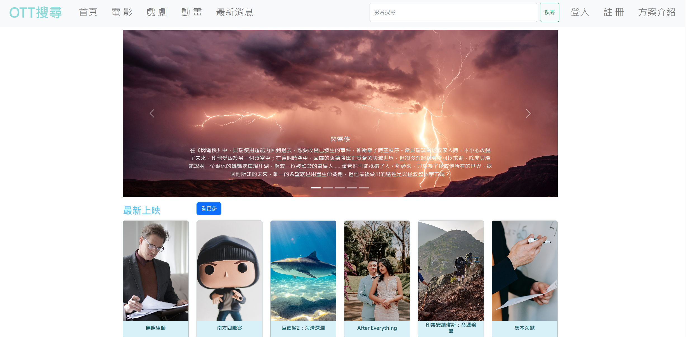
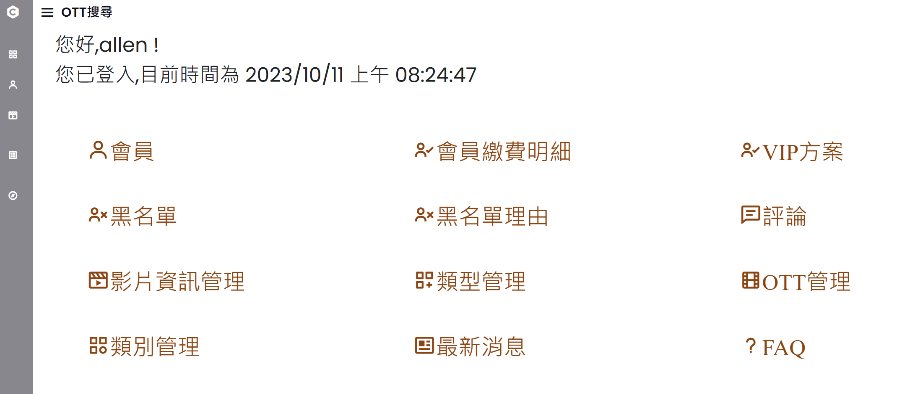
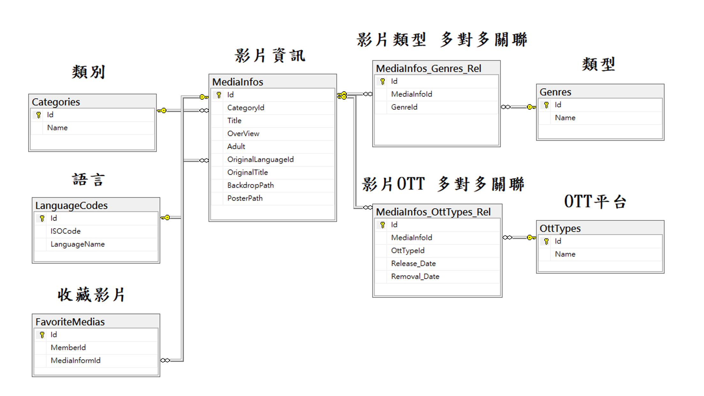
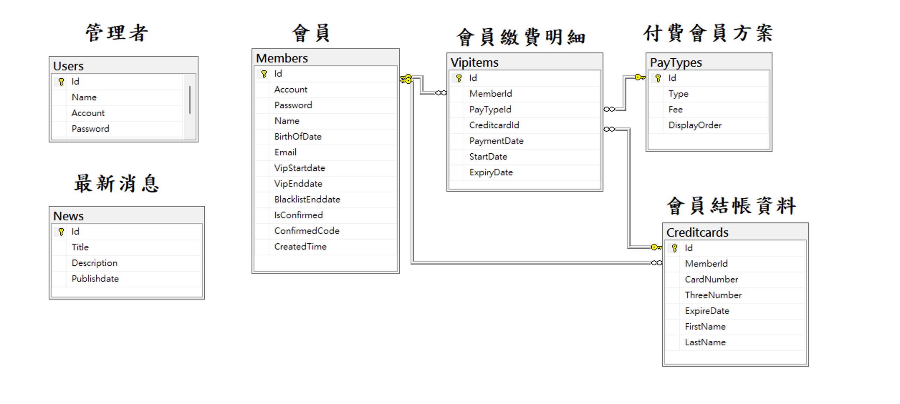
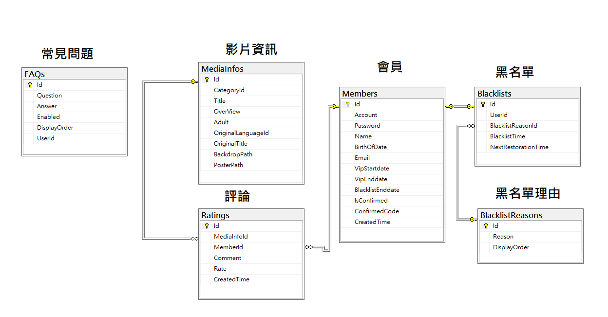

# OTT搜尋平台

## 前台

### 介紹

**提供使用者輕鬆找到他們想要觀看的影片，並提供有關的影片資訊。**

### 功能

1. **會員登錄/登出，訪客註冊**
2. **忘記密碼、寄驗證信重設密碼**
3. **依影片名稱、類別、類型、上映平台做搜尋**
4. **查看影片詳情**
5. **會員可對影片做評分與評論**
6. **違反留言規則之會員，將被停權2個月無法留言**
7. **購買方案成為VIP可享有收藏影片功能**
8. **最新消息**
9. **常見問答**

## 後台

### 介紹

**提供後台管理者，針對前台內容作維護**

### 功能

1. **查詢、詳情、刪除 會員**
2. **新增、編輯、刪除 維護付費方案**
3. **查詢 會員繳費明細**
4. **編輯 黑名單**
5. **新增、編輯、刪除 黑名單理由**
6. **查詢、詳情與刪除 評論**
7. **CRUD 影片資訊**
8. **CRUD 影片類別**
9. **CRUD 影片類型**
10. **CRUD OTT平台**
11. **新增、編輯、刪除 最新消息**
12. **新增、編輯、刪除 常見問答**
13. **後台管理者 登入/登出**

## 資料庫規劃

### 影片資訊 關聯資料表

### 會員關聯資料表

### 評論關聯資料表

